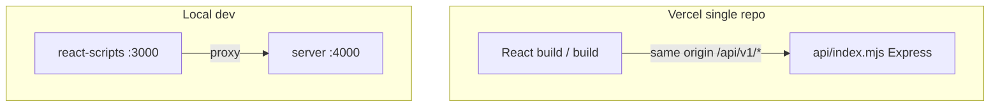

# NS Customization

Web app for configuring custom neon signage: typography, color, mounting, and sizing with a live preview and design proof flow.

## Features

- Live neon-style preview with font and palette controls
- Arabic and Latin font sets, size and adapter options
- Design proof route for review before checkout flows
- Service status strip with loading, success, and error states
- Global error boundary for render failures
- REST API with layered routing, controllers, and services
- Single-repo deploy to Vercel (SPA + `/api` serverless)

## Tech stack

| Layer | Stack |
|--------|--------|
| UI | React 18, React Router 6, Bootstrap 5 |
| Tooling | Create React App (`react-scripts` 5) |
| API | Node.js 18+, Express 4, Helmet, CORS, Morgan |
| Deploy | Vercel (static build + `api/index.mjs`) |

## Prerequisites

- Node.js 18 or newer
- npm 9+ (or compatible)

## Setup (local)

```bash
npm install
npm install --prefix server
npm run dev
```

Runs the React app on port 3000 and the API on port 4000 (proxied in development).

Or run separately:

```bash
npm run dev:web
npm run dev:api
```

## Deploy to Vercel (single repo)

1. Push this repository to GitHub/GitLab/Bitbucket.
2. Import the project in [Vercel](https://vercel.com/new).
3. Vercel reads `vercel.json` automatically:
   - **Build:** `npm run build` → `build/`
   - **Install:** root + `server/` dependencies
   - **API:** `api/index.mjs` serves `/api/*` via Express
   - **SPA:** all other routes → `index.html`
4. Optional environment variables in the Vercel dashboard:

| Variable | Purpose |
|----------|---------|
| `CORS_ORIGIN` | Allowed origin (defaults to `https://<your-vercel-domain>`) |
| `NODE_ENV` | Set to `production` |
| `REACT_APP_API_URL` | Leave empty on Vercel — API is same-origin at `/api` |

5. Deploy. No separate API host required.

```bash
npx vercel
```

## Production build (self-hosted)

```bash
npm run build
npm run start:api
```

Serve `build/` behind your reverse proxy and route `/api` to the Node process.

## Architecture



## Project layout

```
├── api/index.mjs           Vercel serverless entry (Express)
├── vercel.json             Vercel build + rewrites
├── public/
├── server/src/             API source (routes, controllers, services)
├── src/
│   ├── Routes/             Pages
│   ├── atom/               Feature UI blocks
│   ├── components/         Shared UI
│   ├── layouts/
│   ├── services/
│   └── styles/             theme.css, app-shell.css
└── package.json
```

## Goal

Maintainable split between the React configurator and a small JSON API so pricing, orders, and integrations can grow without entangling business rules in the client bundle — deployable as one Vercel project.

## Portfolio blurb

**Neon Sign Customization** — Production-style e-commerce configurator for custom LED neon: responsive studio layout, live preview stage, design proof flow, and an Express API deployable alongside the SPA on Vercel from a single repository.
