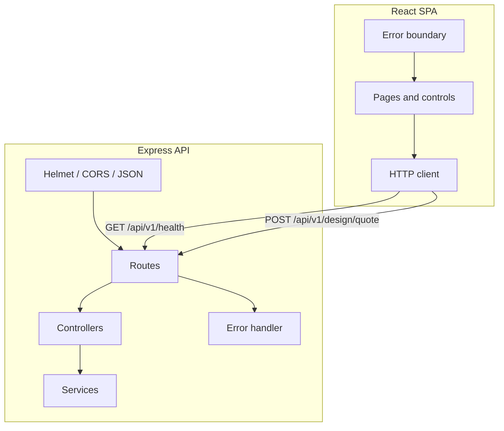

# NS Customization

Web app for configuring custom neon signage: typography, color, mounting, and sizing with a live preview and design proof flow.


## Features

- Live neon-style preview with font and palette controls
- Arabic and Latin font sets, size and adapter options
- Design proof route for review before checkout flows
- Service status strip with loading, success, and error states
- Global error boundary for render failures
- REST API with layered routing, controllers, and services

## Tech stack

| Layer | Stack |
|--------|--------|
| UI | React 18, React Router 6, Bootstrap 5 |
| Tooling | Create React App (`react-scripts` 5) |
| API | Node.js 18+, Express 4, Helmet, CORS, Morgan |

## Prerequisites

- Node.js 18 or newer
- npm 9+ (or compatible)

## Setup

1. Clone the repository and install web dependencies:

```bash
npm install
```

2. Install API dependencies:

```bash
npm install --prefix server
```

3. Environment files (optional in development):

- Copy `.env.example` to `.env` in the repo root if you need a non-empty `REACT_APP_API_URL` (leave blank to use the dev proxy or same-origin requests in production).
- Copy `server/.env.example` to `server/.env` and adjust `PORT`, `CORS_ORIGIN`, and `NODE_ENV` to match your deployment. Production values should stay aligned with your live hostnames and ports.

4. Run web and API together:

```bash
npm run dev
```

Or run each process in its own terminal:

```bash
npm run dev:web
npm run dev:api
```

5. Production build (static client):

```bash
npm run build
```

Serve `build/` from your CDN or static host and run `npm run start:api` (or `node server/src/server.js` with `NODE_ENV=production`) behind your process manager. Point the same host’s `/api` path to the API or set `REACT_APP_API_URL` to the public API origin at build time.

## Goal

Provide a maintainable split between the React configurator and a small JSON API so pricing, orders, and integrations can grow without entangling business rules in the client bundle.

## Mermaid diagram



## Project layout

```
├── public/                 Static assets and HTML shell
├── server/                 Node API (`npm run dev` in this folder)
│   └── src/
│       ├── app.js          Express app factory
│       ├── config/         Environment
│       ├── controllers/
│       ├── middleware/
│       ├── routes/
│       └── services/
├── src/
│   ├── Routes/             Page-level views
│   ├── atom/               Feature-specific UI blocks
│   ├── components/         Shared UI and system chrome
│   ├── hooks/
│   ├── layouts/
│   ├── services/           API client modules
│   └── styles/
├── package.json
└── README.md
```
